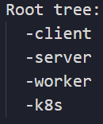
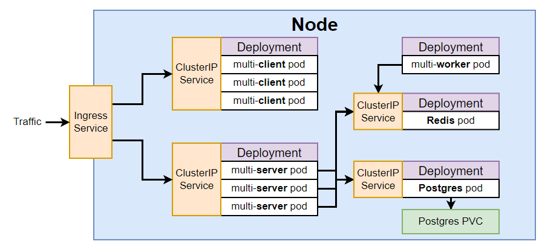
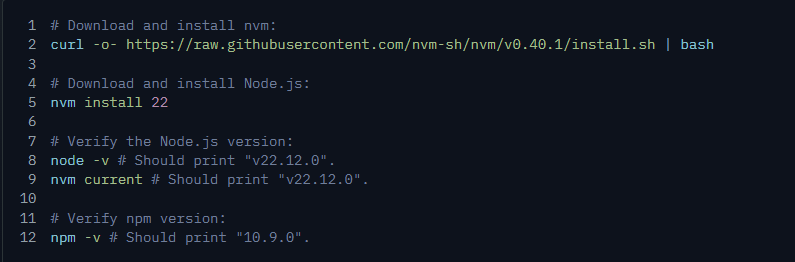

# Multi Container App with Kubernetes on GKE
Bu proje multi-containerlar ile kubernetes uygulaması yapmak amacıyla hazırlanmıştır. React app ve Fibonacci serislerini hesaplama algoritması oluşturularak GKE 'de deploy edilmiştir. (Multi-Docker ElasticBeanstalk projesinin devamı olarak hazırlanmmıştır. Proje mimarisi Project Structure bölümünde listelenmiştir.)

## Important links
* [WSL2](https://learn.microsoft.com/en-us/windows/wsl/about): Bütün proje WSL'de (Windows Subsystem for Linux) hazırlanmıştır.
* [Docker-desktop](https://www.docker.com/products/docker-desktop/): WSL2 ile container ugulamaların oluşturulması ve Kubernetes için VM olarak kullanılması.
* [Docker-hub](https://hub.docker.com/): Hazır servislerin kullanılması ve projede oluşturulan servislerin pushlanması.
* [GCP](https://console.cloud.google.com): Google Cloud Platform ve Google Kubernetes Engine (GKE) projenin deploy edildiği platform.
* [Github Actions](https://github.com/ErcanKurtoglu/multi-k8s/actions): Projenin CI/CD sinin yapıldığı platform.
* [Ingress-nginx](https://github.com/kubernetes/ingress-nginx): Kubernetes projemizde gelen trafiği yönlendirmesi için ingress configurasyonun yapılması. [Kubernetes Deployment Page for intalling ingress controller](https://kubernetes.github.io/ingress-nginx/deploy/) Extra reading: https://www.joyfulbikeshedding.com/blog/2018-03-26-studying-the-kubernetes-ingress-system.html

## Contents of this page
- [Project Metarials](https://github.com/ErcanKurtoglu/multi-k8s#project-metarials)
- [Project Structure](https://github.com/ErcanKurtoglu/multi-k8s#project-structure)

## Project Metarials

Bu tablo dosyalarla ilgili gerekli açılamaları ve linkleri içermektedir.
 
## Folder tree:

| Number | Title | File | Description | Slides |
| -- | -- | -- | -- | -- |
| 00 | [React Server](https://github.com/ErcanKurtoglu/multi-k8s#-00-react-server) | [Folder:client](https://github.com/ErcanKurtoglu/multi-k8s/blob/master/client) | React app ile oluşturuldu | [Goto Slide](https://github.com/ErcanKurtoglu/multi-k8s/blob/master/slides/00_reactserver.pdf) |
| 01 | [Express Server](https://github.com/ErcanKurtoglu/multi-k8s#-01-express-server) | [Folder:server](https://github.com/ErcanKurtoglu/multi-k8s/blob/master/server) | Express serverın olduğu, işlem yapılan verilerin akışının sağlandığı kaynak. | [Goto Slide](https://github.com/ErcanKurtoglu/multi-k8s/blob/master/slides/01_expressserver.pdf) |
| 02 | [Fibonacci](https://github.com/ErcanKurtoglu/multi-k8s#-02-fibonacci) | [Folder:worker](https://github.com/ErcanKurtoglu/multi-k8s/blob/master/worker) | Fibonocci algoritmasının çalıştığı kaynak | |
| 03 | [Kubernetes](https://github.com/ErcanKurtoglu/multi-k8s#-03-kubernetes) | [Folder:k8s](https://github.com/ErcanKurtoglu/multi-k8s/blob/master/k8s) | Kubernetis config dosyalarının bulunduğu kaynak | [Goto Slide](https://github.com/ErcanKurtoglu/multi-k8s/blob/master/slides/03_kubernetes.pdf) |
| 04 | [Github Actions](https://github.com/ErcanKurtoglu/multi-k8s#-04-github-actions) | [Folder:.github/workflows](https://github.com/ErcanKurtoglu/multi-k8s/blob/master/.github/workflows) | Github actions CI/CD için gerekli yaml dosyası| [Goto Slide](https://github.com/ErcanKurtoglu/multi-k8s/blob/master/slides/04_githubactions.pdf) |
| 05 | [Github Actions Secret, repo secret](https://github.com/ErcanKurtoglu/multi-k8s#-05-github-actions-secret) |  | GKE user secret file encrypt etme ve repo secretlarını ekleme| [Goto Slide](https://github.com/ErcanKurtoglu/multi-k8s/blob/master/slides/05_secrets.pdf) |
|----|----|----|

## Project Structure
Bu projede hazırlanan serviceler, podlar, clusterlar şematik olarak gösterilmiştir ve gerekli şemalara tablodaki linklerden ulaşılabilir.

Genel proje mimarisi:

| File | Description | Schema |
| -- | -- | -- |
| [Old system architecture(Docker Container)](https://github.com/ErcanKurtoglu/multi-k8s/blob/master/service-account.json.gpg) | Bu proje daha önce Docker Container kullanılarak AWS üzerinden EBS ile deploy edilmek üzere hazırlanmıştır. Temal mimari şeması => | [Goto Schema](https://github.com/ErcanKurtoglu/multi-k8s/blob/master/slides/service-account.json.gpg) |
|----|----|----|

### 🔐 00. React Server

1. <u>Downloaded Node.js:</u> 

    WSL sisteminde çalışıldığı için Node.js linux için nvm kullanılarak indirildi.  
    https://nodejs.org/en/download

    

2. <u>Created react app:</u>

    

3. <u>Added Fib.js and Other.js:</u> 

    **Fib.js:** fibonacci algoritmasının değerinin kullanıcı tarafından girildiği ve sonucunun gösterildiği sayfa. Aynı zamanda girilen tüm değerler yine bu sayfada gösterilmektedir.  
    **Other.js:** boş bir sayfadır.

###  01. Express Server

###  02. Fibonacci

###  03. Kubernetes

###  04. Github Actions

### 🔐 05. Secrets

